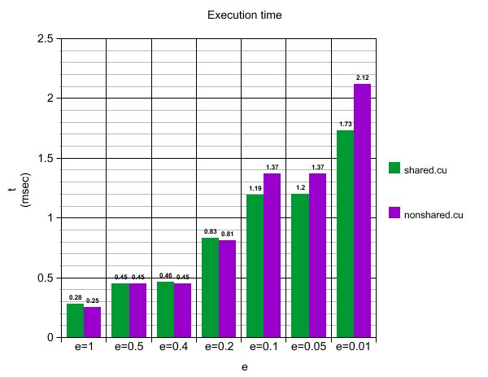

# Mean Shift Algorithm Implementation Using CUDA

This repository contains an implementation of the Mean Shift algorithm using CUDA for the course "Parallel and Distributed Systems." The project aims to evaluate the performance improvements achieved through parallelizing the algorithm. Three versions have been developed: a serial implementation, and two parallel versions—one using shared memory and one without.

## Prerequisites

- GCC for compiling C code
- NVIDIA CUDA Toolkit for compiling CUDA code
- Docker (if you want to run in container)

## Project Files Description

- __serial.c__ - Serial implementation of the Mean Shift algorithm, serving as the baseline for comparison.
- __nonshared.cu__ - Parallel implementation without the utilization of shared memory.
- __shared.cu__ - Parallel implementation that utilizes shared memory to increase speed.
- __input.txt__ - Input data for the algorithm.
- __output_reference.txt__ - Reference data used to verify the algorithm's output.
- __output.txt__ - Contains the results from the most recent run of any implementation.
- __graph.png__ - Graph depicting the results of a test run in a distributed system.
- __Makefile__ - Build rules and run targets with GPU flags.
- __Dockerfile__ - Multi-stage build for a minimal CUDA runtime image.

## Building and Run Locally

Run all programs with:
```bash
make all
```

This will compile the following binaries:

- __serial__ - For the serial implementation.
- __nonshared__ - For the CUDA implementation without shared memory.
- __shared__ - For the CUDA implementation with shared memory.

## Usage

To run all the programs run:
```bash
make run_all
```
Or run a specific version with:
```bash
make run_serial 
```
Specify the convergence criterion `e` for the Mean Shift algorithm by passing it as a parameter:
```bash
make run_all INPUT=0.05
```
Or for a specific version:
```bash
make run_shared INPUT=0.05
```
If not specified, the default value of 0.5 is used.

## Using Docker

Build the Docker image:
```bash
docker build -t mean-shift-cuda .
```

Run with default parameters:
```bash
docker run --gpus all mean-shift-cuda
```
- This runs `make run_all` inside the container, using `INPUT=0.5`.

Override commands example:
```bash
docker run --gpus all mean-shift-cuda make run_shared INPUT=0.01
```

## Implementation Details

### Data Representation
- **Arrays:** Instead of using multi-dimensional arrays, the data is represented using one-dimensional arrays. This approach simplifies memory access and enhances the performance in CUDA. Arrays are sized as `arrays * columns`, with data points indexed every two elements.

### Memory Management
- **Dynamic Arrays:** The `arrayStatic`, `arrayYk`, and `arrayYkplus1` arrays are dynamically created and initialized with the data from `input.txt`. At the start of the Mean Shift algorithm, `arrayYk` is set to the initial data points, representing `arrayStatic`.

### Parameter Handling
**Convergence Criterion (e):** The convergence parameter `e` is converted to a float using `atof()`. The execution times are recorded from the start to the finish of the algorithm for each data point, to assess the impact of different values of `e`.

## Performance Analysis

Performance tests were conducted on a distributed system, comparing both shared and non-shared memory implementations across a range of convergence thresholds `e`.

The shared memory implementation benefits significantly when the convergence criterion `e` is smaller, leading to more iterations and hence better performance. A graph of the results can be seen below:



The graph above visualizes the execution times, demonstrating the advantages of the shared memory implementation, particularly for smaller values of `e`.

Moreover, performance tests were conducted in two different computers:

- __System A (Local):__ Intel Core i5-8300H @ 2.30 GHz + GeForce GTX 1060
- __System B (Docker):__ Intel Core i9-14900HX @ 2.20 GHz + GeForce RTX 5060 Ti

The produced results between the two systems for `e` = 0.005 are in the table below:

| Implementation | System A (GTX 1060) | System B (RTX 5060 Ti) | Speedup (A→B) |
|---------------:|---------------------|------------------------|---------------|
| **Serial**     |            20.11 ms |                9.16 ms |         2.20× |
| **Non‑shared** |             2.04 ms |                0.75 ms |         2.72× |
| **Shared**     |             1.06 ms |                0.61 ms |         1.74× |

CUDA implementations compared to the serial baseline on each system:

| Implementation | System A Speedup (Serial → Parallel) | System B Speedup (Serial → Parallel) |
|---------------:|--------------------------------------|--------------------------------------|
| **Non‑shared** |                  20.11 / 2.04 ≈ 9.9× |                  9.16 / 0.75 ≈ 12.2× |
| **Shared**     |                 20.11 / 1.06 ≈ 19.0× |                  9.16 / 0.61 ≈ 15.0× |

## Conclusions

- **Shared Memory Utilization** - Using shared memory is particularly beneficial for smaller values of the convergence criterion `e`, as demonstrated by the faster execution times for `e=0.1`, `0.05`, `0.01`.
- **Performance Enhancement** - Parallelization with CUDA significantly reduces the execution time compared to the serial implementation, highlighting the effectiveness of CUDA in enhancing algorithmic performance in distributed systems.

## Further Development

Further development could include adding tests at each stage of the algorithm and experimenting with CUDA optimizations for specific GPU architectures. Profiling could also provide insights into potential performance bottlenecks.
